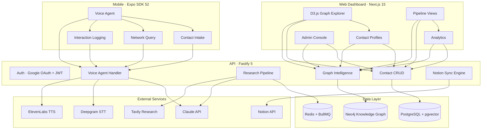

<div align="center">


# Partnerships OS

**Enterprise partnership intelligence powered by knowledge graphs, voice AI, and automated research.**

[](https://www.typescriptlang.org/)
[](https://nextjs.org/)
[](https://neo4j.com/)
[](https://fastify.dev/)
[](LICENSE)

[](https://github.com/JiwaniZakir/Partnerships_OS/stargazers)
[](https://github.com/JiwaniZakir/Partnerships_OS/network/members)

<br />

[Getting Started](#-quick-start) · [Architecture](#-architecture) · [Features](#-features) · [Contributing](#-contributing)

</div>

<br />

## Overview

Partnerships OS is a three-tier intelligence platform that transforms contacts and partnerships into a richly researched, deeply connected knowledge graph. It combines a **Neo4j graph database** for relationship mapping, a **voice-first AI agent** for hands-free data capture, and a **Notion-synced CRM** — enabling teams to build, track, and leverage their collective network with unprecedented depth.

<br />

## :sparkles: Features

- **Knowledge Graph Engine** — Neo4j-powered relationship mapping with typed edges capturing strength, context, and history across contacts, organizations, and interactions
- **Voice-First AI Agent** — Mobile voice interface (Deepgram STT + ElevenLabs TTS + Claude reasoning) supporting contact intake, network queries, interaction logging, and outreach recommendations
- **Automated Research Pipeline** — BullMQ background jobs that enrich contacts via Tavily web research, Claude-powered synthesis, pgvector embeddings, and Neo4j graph inference
- **Interactive Graph Visualization** — D3.js force-directed network explorer with filters, community detection, and path-finding between any two nodes
- **Notion Bi-Directional Sync** — Real-time mirroring of contacts, interactions, and pipeline state to structured Notion databases with per-member views
- **RAG-Powered Search** — Hybrid semantic search combining pgvector embeddings, Neo4j graph traversal, and full-text search with Claude-generated natural language answers
- **AI Discovery Engine** — Event planning, gap analysis, and warm intro pathfinding powered by graph analysis and LLM reasoning

<br />

## :building_construction: Architecture



<br />

## :hammer_and_wrench: Tech Stack

<table>
<tr><td><b>Monorepo</b></td><td>


</td></tr>
<tr><td><b>Backend</b></td><td>


</td></tr>
<tr><td><b>Databases</b></td><td>


</td></tr>
<tr><td><b>AI / Voice</b></td><td>


</td></tr>
<tr><td><b>Web</b></td><td>


</td></tr>
<tr><td><b>Mobile</b></td><td>


</td></tr>
</table>

<br />

## :open_file_folder: Project Structure

```
partnerships-os/
├── apps/
│   ├── api/                     # Fastify 5 backend
│   │   ├── src/
│   │   │   ├── auth/            # Google OAuth + JWT + domain guard
│   │   │   ├── contacts/        # Contact CRUD + research trigger
│   │   │   ├── interactions/    # Interaction logging
│   │   │   ├── members/         # Internal team management
│   │   │   ├── graph/           # Neo4j ops, RAG search, discovery
│   │   │   ├── research/        # AI enrichment pipeline + enrichers
│   │   │   ├── voice/           # Voice agent orchestrator + handlers
│   │   │   ├── notion/          # Bi-directional sync engine
│   │   │   ├── jobs/            # BullMQ workers + cron
│   │   │   └── config/          # Env, DB connections, approved members
│   │   ├── prisma/              # Schema + migrations
│   │   └── tests/
│   ├── web/                     # Next.js 15 dashboard
│   │   └── src/
│   │       ├── app/             # App Router (dashboard, graph, contacts, discover)
│   │       ├── components/      # shadcn/ui, D3 graph, charts
│   │       ├── hooks/
│   │       └── lib/             # API client, auth
│   └── mobile/                  # Expo voice-first app
│       ├── app/                 # Expo Router screens
│       ├── components/          # VoiceButton, Waveform, Transcript
│       ├── services/            # Voice WebSocket, API, auth
│       └── stores/              # Zustand state
├── packages/
│   └── shared/                  # TypeScript types + Zod schemas
├── scripts/                     # Seed, migrations, Notion setup
├── docker-compose.yml           # PostgreSQL + pgvector, Neo4j, Redis
├── turbo.json
└── pnpm-workspace.yaml
```

<br />

## :rocket: Quick Start

### Prerequisites

- **Node.js** 20+
- **pnpm** 9+
- **Docker** (for PostgreSQL, Neo4j, Redis)

### Installation

```bash
# Clone the repository
git clone https://github.com/JiwaniZakir/Partnerships_OS.git
cd Partnerships_OS

# Install dependencies
pnpm install

# Start infrastructure (PostgreSQL + pgvector, Neo4j, Redis)
docker compose up -d

# Configure environment
cp .env.example .env
# Add your API keys (Anthropic, OpenAI, Deepgram, Tavily, Notion, Google OAuth)

# Run database migrations
pnpm db:migrate
pnpm neo4j:migrate

# Seed with sample data
pnpm db:seed

# Start all apps in development
pnpm dev
```

### Services

| Service | URL |
|:--------|:----|
| **API Server** | `http://localhost:3001` |
| **Web Dashboard** | `http://localhost:3000` |
| **Neo4j Browser** | `http://localhost:7474` |
| **Mobile (Expo)** | `npx expo start` |

<br />

## :card_index: Data Model

### PostgreSQL (Prisma)

| Model | Purpose |
|:------|:--------|
| `Member` | Internal team members authenticated via Google OAuth |
| `Contact` | External network contacts with AI research profiles + embeddings |
| `Organization` | Companies, VC firms, universities, nonprofits |
| `Interaction` | Meeting notes, calls, emails with AI-generated summaries |
| `AuditLog` | Full operation audit trail for compliance |

### Neo4j Graph

```cypher
(:Contact)-[:WORKS_AT {title, since}]->(:Organization)
(:Contact)-[:KNOWS {context, strength}]->(:Contact)
(:Member)-[:ONBOARDED {date, context}]->(:Contact)
(:Member)-[:HAD_INTERACTION {type, date}]->(:Contact)
(:Contact)-[:TAGGED_AS]->(:Tag)
(:Contact)-[:IN_GENRE]->(:Genre)
(:Organization)-[:PARTNERED_WITH]->(:Organization)
```

<br />

## :handshake: Contributing

Contributions are welcome! Please see [CONTRIBUTING.md](.github/CONTRIBUTING.md) for guidelines on how to get started.

1. Fork the repository
2. Create your feature branch (`git checkout -b feature/amazing-feature`)
3. Commit your changes (`git commit -m 'Add amazing feature'`)
4. Push to the branch (`git push origin feature/amazing-feature`)
5. Open a Pull Request

<br />

## :page_facing_up: License

This project is licensed under the **MIT License** — see the [LICENSE](LICENSE) file for details.

<br />

<div align="center">

Built by [Zakir Jiwani](https://github.com/JiwaniZakir)

</div>
