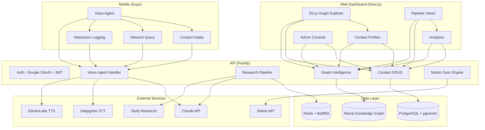

# Partnerships OS

[](https://www.typescriptlang.org/)
[](https://nextjs.org/)
[](https://neo4j.com/)
[](https://expo.dev/)
[](LICENSE)

Enterprise partnership intelligence platform. Neo4j knowledge graph, voice-first AI agent, Notion-synced CRM.

---

## Architecture



## Features

### Neo4j Knowledge Graph
Relationship-first data model that maps the full network — contacts, organizations, members, and interactions as nodes, with typed edges capturing relationship strength, context, and history. Graph queries power network discovery, path-finding between contacts, and AI-driven partnership recommendations.

### Voice-First AI Agent
Mobile voice interface powered by Deepgram (STT) and ElevenLabs (TTS) with Claude as the reasoning engine. Supports four intents:
- **Intake** — Add new contacts via conversational voice input
- **Query** — Ask questions about the network using RAG over the knowledge graph
- **Log** — Record meeting notes and interaction summaries hands-free
- **Recommend** — Get AI-powered outreach suggestions based on graph analysis

### Research Pipeline
Background job system (BullMQ) that automatically enriches new contacts:
1. Web research via Tavily API
2. Claude-powered synthesis of findings
3. pgvector embedding generation for semantic search
4. Neo4j graph node creation with relationship inference
5. Notion page sync with structured templates

### Notion Integration
Bi-directional sync engine that mirrors contacts, interactions, and pipeline state to Notion databases. Uses structured page templates for consistent formatting.

### Web Dashboard
Next.js 15 app with D3.js force-directed graph visualization, contact profiles with interaction timelines, pipeline analytics via Recharts, and admin controls.

---

## Tech Stack

| Layer | Technology |
|-------|-----------|
| **Monorepo** | Turborepo + pnpm workspaces |
| **API** | Fastify 5, TypeScript |
| **Database** | PostgreSQL 16 + Prisma ORM + pgvector |
| **Graph** | Neo4j Community Edition |
| **Queue** | BullMQ on Redis |
| **Auth** | Google OAuth + JWT (RS256) |
| **AI** | Claude API (Anthropic SDK), OpenAI embeddings |
| **Voice** | Deepgram Nova-2 (STT), ElevenLabs (TTS) |
| **Research** | Tavily API |
| **Sync** | Notion API |
| **Web** | Next.js 15, Tailwind CSS 4, shadcn/ui, D3.js, Recharts |
| **Mobile** | React Native, Expo SDK 52, Expo Router 4, Zustand |

## Project Structure

```
partnerships-os/
├── apps/
│   ├── api/                          # Fastify backend
│   │   ├── src/
│   │   │   ├── auth/                 # Google OAuth + JWT
│   │   │   ├── contacts/             # Contact CRUD
│   │   │   ├── interactions/         # Interaction logging
│   │   │   ├── members/              # Internal team management
│   │   │   ├── graph/                # Neo4j operations + discovery
│   │   │   ├── research/             # AI enrichment pipeline
│   │   │   ├── voice/                # Voice agent (intake/query/log/recommend)
│   │   │   ├── notion/               # Sync engine
│   │   │   ├── jobs/                 # BullMQ workers
│   │   │   ├── admin/                # Admin endpoints
│   │   │   └── config/               # Environment + DB connections
│   │   ├── prisma/                   # Schema + migrations
│   │   └── tests/
│   ├── web/                          # Next.js dashboard
│   │   └── src/
│   │       ├── app/                  # App Router pages
│   │       ├── components/           # UI components + D3 graph
│   │       ├── hooks/
│   │       └── lib/                  # API client, auth
│   └── mobile/                       # React Native voice app
│       ├── app/                      # Expo Router screens
│       ├── components/
│       ├── services/                 # Voice, API, auth
│       └── stores/                   # Zustand state
├── packages/
│   └── shared/                       # TypeScript types + Zod schemas
├── scripts/                          # Seed, migrations, setup
├── docker-compose.yml                # PostgreSQL, Neo4j, Redis
├── turbo.json
├── pnpm-workspace.yaml
└── package.json
```

## Quick Start

### Prerequisites

- Node.js 20+
- pnpm 9+
- Docker (for PostgreSQL, Neo4j, Redis)

### Setup

```bash
git clone https://github.com/JiwaniZakir/Partnerships_OS.git
cd Partnerships_OS

# Install dependencies
pnpm install

# Start infrastructure
docker compose up -d

# Configure environment
cp .env.example .env
# Edit .env with your API keys

# Run database migrations
pnpm db:migrate
pnpm neo4j:migrate

# Seed initial data
pnpm db:seed

# Start all apps in development
pnpm dev
```

### Services

| Service | URL |
|---------|-----|
| API | http://localhost:3001 |
| Web Dashboard | http://localhost:3000 |
| Neo4j Browser | http://localhost:7474 |
| Mobile (Expo) | `npx expo start` |

## Data Model

### PostgreSQL (Prisma)

| Model | Purpose |
|-------|---------|
| **Member** | Internal team members (Google OAuth) |
| **Contact** | External network contacts with research data |
| **Organization** | Companies and institutions |
| **Interaction** | Meeting notes, calls, emails |
| **AuditLog** | All operations logged for compliance |

### Neo4j Graph

```cypher
(:Contact)-[:WORKS_AT]->(:Organization)
(:Contact)-[:KNOWS]->(:Contact)
(:Member)-[:ONBOARDED]->(:Contact)
(:Member)-[:MET_WITH]->(:Contact)
(:Contact)-[:AFFILIATED_WITH]->(:Organization)
```

## Contributing

See [CONTRIBUTING.md](.github/CONTRIBUTING.md) for guidelines.

## License

MIT License. See [LICENSE](LICENSE) for details.
